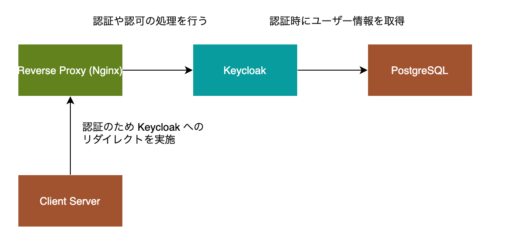
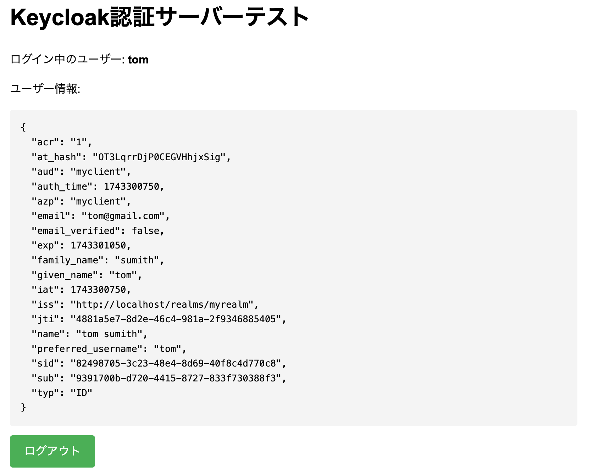

# Keycloak を活用した認証基盤構築とシングルサインオン環境の実現

<p align="center">
  
</p>


[](https://www.python.org/)

[](https://docs.docker.com/compose/)


## 概要
このプロジェクトは、Docker Compose を使用して、Keycloak を中心としたシングルサインオン (SSO) 環境を構築することを目的としています。Keycloak は、オープンソースの認証および認可サーバーで、ユーザー管理、認証、シングルサインオン（SSO）機能を提供します。本プロジェクトでは、複数のコンテナ（Keycloak、PostgreSQL、Nginx）を組み合わせ、効率的でスケーラブルな認証基盤を構築します。

### シングルサインオン環境のメリット
シングルサインオン（SSO）環境を構築することで、ユーザーは一度の認証で複数のアプリケーションやサービスにアクセスできるようになります。これにより、ユーザー体験が向上し、パスワード管理の負担が軽減されます。企業にとっては、セキュリティの強化、ユーザー管理の一元化、運用コストの削減といったメリットがあります。また、ユーザーが複数のサービスで異なるログイン情報を管理する必要がなくなり、認証ミスやセキュリティリスクの低減にも寄与します。

### 使用する技術スタック（Keycloak）
本プロジェクトでは、認証基盤として Keycloak を採用しています。Keycloak は、OAuth 2.0、OpenID Connect、SAML などの認証プロトコルをサポートし、ユーザー認証の管理を簡素化します。さらに、組み込みのユーザー管理機能、シングルサインオン機能、多要素認証（MFA）、LDAP や Active Directory との統合もサポートしています。これにより、複数のアプリケーションやサービスを統合する際に、シームレスな認証管理が可能となります。また、Docker Compose を利用することで、複数のサービスを簡単に立ち上げ、開発環境の構築を効率化します。

### シングルサインオンとは

**シングルサインオン（SSO）** は、ユーザーが一度のログインで複数のアプリケーションやサービスにアクセスできる認証システムのことです。SSO を導入することで、ユーザーは各アプリケーションに対して個別にログインする必要がなくなり、複数のシステムにアクセスする際の利便性が向上します。認証が一度行われると、ユーザーが他の関連するサービスにアクセスする際に再度ログインを求められることはありません。これにより、ユーザー体験の向上とともに、セキュリティの強化やパスワード管理の簡素化が実現します。

SSO は、**OAuth 2.0**、**OpenID Connect**、**SAML** などの標準プロトコルを使用して実装され、認証情報をセキュアに管理します。特に大規模なシステムでは、SSO により、認証機能を一元化して管理することが可能になり、運用やセキュリティの観点からも大きな利点があります。

### マイクロサービスアーキテクチャにおける認証の役割とは

**マイクロサービスアーキテクチャ（MSA）** では、アプリケーションが小さな独立したサービスに分割され、各サービスが特定の機能を担います。このアーキテクチャにおける最大の課題の一つが、認証と認可をどのように管理するかです。マイクロサービスごとに認証を管理すると、複雑性が増し、セキュリティの脆弱性が生まれやすくなります。ここで重要なのが、SSO を活用することです。

MSA において、認証は次のような役割を果たします：

1. **ユーザー管理の一元化**
   各マイクロサービスが個別に認証を管理するのではなく、SSO サーバーを中心にユーザー認証を一元化することで、セキュリティポリシーの統一が可能になります。これにより、ユーザーがどのサービスにアクセスしても一貫した認証処理が行われます。

2. **セキュアなアクセス制御**
   各サービスが独立して認証を行うと、認証情報が分散し、漏洩や不正アクセスのリスクが高まります。SSO を導入することで、認証情報は一箇所に集約され、アクセス制御やセキュリティポリシーを一元的に管理できます。

3. **サービス間のトラストとトークンベースの認証**
   マイクロサービス間でユーザー情報を共有するために、SSO サーバーから発行されるトークン（例：JWT）を利用します。サービス間でトークンを検証することによって、ユーザーがどのサービスにアクセスしても、そのアクセスが認証済みであることを保証できます。

4. **スケーラビリティと運用の効率化**
   マイクロサービスが増えていく中で、個別に認証を設定するのは非常に手間がかかり、運用コストも高くなります。SSO を導入することで、新たなサービスの追加時に認証設定が簡略化され、スケーラビリティが向上します。

このように、マイクロサービスアーキテクチャにおける認証は、セキュリティを確保し、効率的な管理を実現するために、SSO などの技術が重要な役割を果たします。

## アーキテクチャ

本システムは、Keycloak、PostgreSQL、Nginx の3つの主要なコンポーネントで構成され、Docker Compose を利用してこれらを連携させたシングルサインオン（SSO）環境を提供します。

### Keycloak
   Keycloak は認証および認可サーバーとして機能し、ユーザー認証を行います。ユーザーのログイン、セッション管理、アクセス制御を統括し、ユーザー情報を管理します。Keycloak は、OAuth 2.0 や OpenID Connect などの標準的な認証プロトコルをサポートしており、他のサービスと簡単に統合できます。アプリケーションへのアクセスを許可するためのトークン発行も担います。

### PostgreSQL
   PostgreSQL は、Keycloak のユーザーデータや設定情報を保存するためのリレーショナルデータベースです。Keycloak が提供する認証機能を実現するために、ユーザー情報やセッションデータを格納し、認証要求があるたびにデータベースにアクセスします。PostgreSQL は、高いパフォーマンスと拡張性を備えており、信頼性の高いデータベースとして Keycloak のバックエンドで使用されます。

### Nginx
   Nginx は、リバースプロキシとして機能し、外部からのリクエストを Keycloak に転送します。ユーザーがアプリケーションにアクセスすると、Nginx がそのリクエストを受け取り、認証が必要な場合は Keycloak にリダイレクトします。これにより、Keycloak での認証処理後、クライアントサーバーに対してシームレスなアクセスが提供されます。Nginx はまた、セキュリティ強化のためのHTTPS設定や負荷分散の役割も果たします。

これらのコンポーネントは、各々の役割に応じて密接に連携し、堅牢で安全なシングルサインオン環境を提供します。

## 起動方法と動作確認

このセクションでは、Keycloak の設定手順とクライアントの作成からユーザー管理までの流れを解説します。

### 1. コンテナの起動
まず、プロジェクトディレクトリに移動し、以下のコマンドでコンテナを起動します：

```
docker compose up
```

これにより、Keycloak、PostgreSQL、Nginx のコンテナがバックグラウンドで起動します。コンテナが起動するのを待ってから、次のステップに進んでください。

### 2. Keycloak の設定手順
管理コンソールへアクセス
ブラウザで以下の URL にアクセスします。

```
http://localhost:8080/admin/
```

ここで、管理者アカウント「admin」と「adminpass」を使用してログインします。

### 3. 新しい Realm の作成
Keycloak の管理画面で、認証の単位となる「Realm」を作成します。以下の手順で作成します：
+ 「Realm」の管理画面で、「Add realm」をクリックします。
+ 「Realm Name」に myrealm という名前を設定し、「Create」をクリックします。

### 4. クライアントの作成
次に、Keycloak に新しいクライアントを追加します。
+ 「Clients」メニューに移動し、「Create」ボタンをクリックします。
+ クライアント ID に myclient を設定し、「Save」をクリックします。

### 5. クライアントの設定
クライアント詳細設定画面で、以下の設定を行います：
```
Root URL: http://localhost
Redirect URI: http://localhost/callback
Web Origin: http://localhost
Authorization Services Enabled: true
Allow direct access grants: true
Standard Flow Enabled: true
Implicit Flow Enabled: false
Front-channel Logout: true
Back-channel Logout: true
```

設定後、「Save」をクリックして変更を保存します。<br>
この設定により、myclient は OpenID Connect を利用した認証を行い、http://localhost/callback へのリダイレクトが許可されます。

### 6. クライアントシークレットの取得
クライアント詳細ページで、「Credentials」タブをクリックします。<br>
そこに表示される「Client Secret」をコピーし、後でコード（例: main.py）に使用します。

### 7. ユーザーの作成
次に、Keycloak で新しいユーザーを作成します：
+ 左側の「Users」タブをクリックし、「Add user」ボタンをクリックします。
+ ユーザー情報を入力し、「Save」をクリックします。
+ ユーザー詳細ページで「Credentials」タブを開き、パスワードを設定します。
+ 「Temporary」を OFF に設定して、ユーザーが初回ログイン時にパスワード変更を求められないようにします。

### 8. 動作確認
すべての設定が完了したら、ブラウザで以下の URL にアクセスし、ログインを確認します。

```
http://localhost
```
ここで、設定したクライアントに対してシングルサインオンが正常に機能しているかを確認できます。

成功すると以下の画面が出力されます。

<p align="center">
  
</p>


